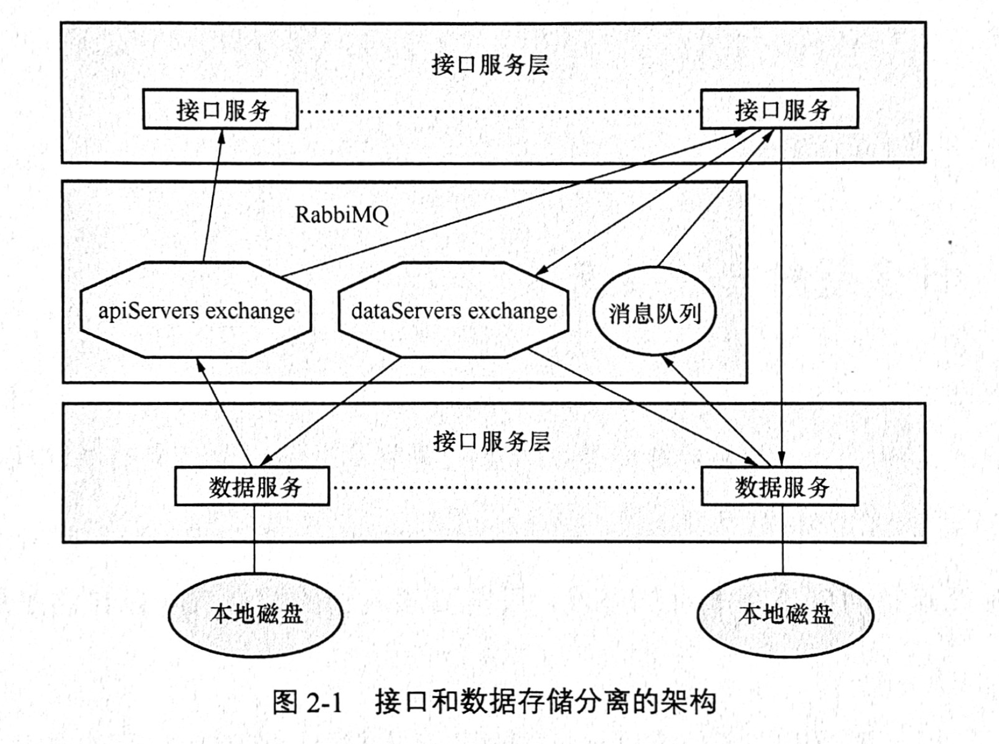
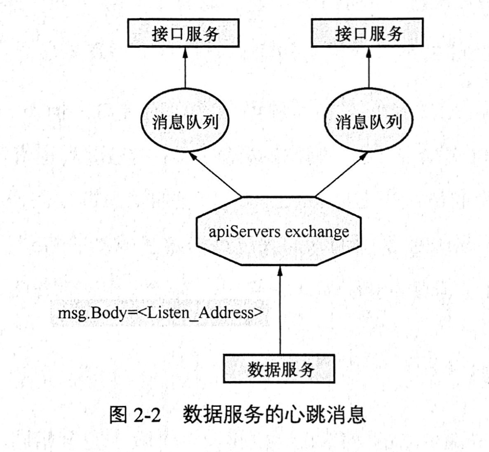
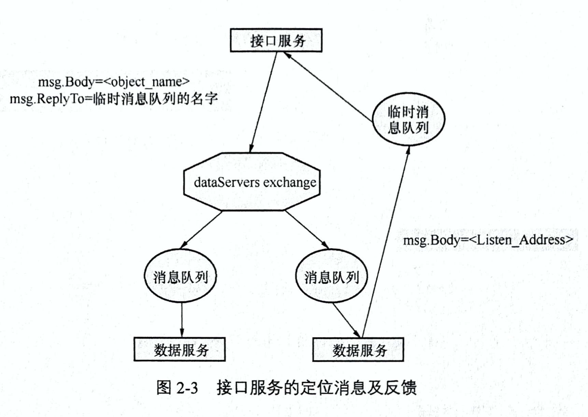

[TOC]

#《分布式对象存储原理架构Go实现》读书笔记

## Chapter 1 基本存储功能
+ 实现了对象存储的put和get的http接口

## Chapter 2
+ 上一章单机版的对象存储模型，接口服务层和数据服务层是紧密耦合在一起的，增加节点并不能增加整个服务的可用、可靠性。为了要做成分布式的，就要把接口服务层和数据服务层拆分开来，就可以接口服务层和数据服务层任意增加节点了（隐隐约约把握到了一点分布式系统的设计原则，暂且称之为服务划分吧）。
+ 这一章的目的就是把接口服务层和数据服务层拆分开，架构如图。

+ 名词解释
    + apiServers exchange：每个数据服务都应该让接口服务感知到自己的存在，因此数据服务持续地向apiServers中发送心跳消息，所有的接口服务启动以后都会创建一个消息队列绑定这个exchange，因此发向这个exchange的消息都会转发给和它绑定的所有消息队列。
    + dataServers exchange：接口服务收到对象GET请求时，定位改对象被保存在哪个数据节点上，所有的数据节点服务绑定这个exchange并接受来自接口服务的定位消息，拥有该对象的数据服务节点使用消息单发通知该接口服务节点（1v1).
+ 为什么使用REST和消息队列两种类型的接口？
    + 因为消息队列不适合传输巨大的对象，REST接口对于群发力不从心。
+ 数据服务的心跳上报流程

    + 每个接口服务节点启动后，会创建自己的消息队列并绑定到apiServers exchange，每个数据服务节点在启动后每隔5s就发送一条消息到apiServers exchange，消息正伟是数据服务节点的http监听地址，接口服务节点在收到消息后记录这个地址。
+ 数据定位流程

    + 每个数据服务节点在启动时会将自己的消息队列绑定至dataServers exchange，接口服务需要定位时，创建一个消息队列，并将这个消息队列的名字以及对象发送给dataServers exchange，定位成功的数据节点服务会将消息发送到这个消息队列，临时消息队列会在一定时间后关闭，如果关闭前没有收到任何反馈则定位失败。
+ 本章和上一章比增加了什么
    + 实现了一个最简单的分布式（不考虑一致性等问题），可以在服务层和数据层横向增加节点
+ 实现的分布式kvdemo存在的问题
    + 数据去重
    + PUT多副本不一致，GET幂等性
    
## Chapter 3 元数据服务
+ 本章加入了元数据服务，在不删除数据的情况下实现对象的删除功能。
+ 实现数据的版本控制。
+ 保证对象数据的一致性和GET方法的幂等性。

## Chapter 4 数据校验和去重
+ 本章实现了数据对象存储的去重功能。
+ 对数据服务的对象定位性能进行优化。

## Chapter 5 数据冗余和即时修复
+ 介绍了数据损坏的成因及应对硬板，使用RS纠删码实现数据冗余策略。
+ 同时实现了在GET对象检查并即时修复对象的技术。

## Chapter 6 断点续传
+ 实现了断点下载和断点上传，断点下阿紫交文件单，断点上传实现较为复杂。

## Chapter 7 数据压缩
+ 本章介绍了常用的数据压缩算法如bzip2, flate, gzip, lzw, zlib等。
+ 使用gzip完成了数据压缩的实现。

